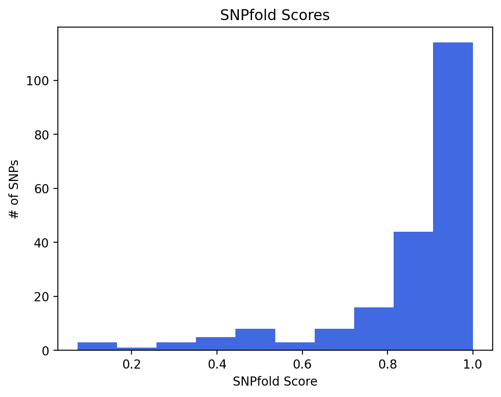

=========
Examples
=========

Analyze a subset variants in the yeast genome
=============================================

1. Download the yeast genome and variants
-----------------------------------------

First, change directories to where you would like your test files to be located. Then
create a folder titled "yeast_data"

.. code:: bash

    mkdir yeast_data

Next, download the yeast genome and gene file from Ensembl.

.. code:: bash

    wget http://ftp.ensemblgenomes.org/pub/fungi/release-55/fasta/saccharomyces_cerevisiae/dna/Saccharomyces_cerevisiae.R64-1-1.dna.toplevel.fa.gz
    wget https://ftp.ensembl.org/pub/release-109/gff3/saccharomyces_cerevisiae/Saccharomyces_cerevisiae.R64-1-1.109.gff3.gz
    

Unzip the files and move them to the yeast_data folder

.. code:: bash

    gunzip Saccharomyces_cerevisiae.R64-1-1.dna.toplevel.fa.gz && mv Saccharomyces_cerevisiae.R64-1-1.dna.toplevel.fa yeast_data/
    gunzip Saccharomyces_cerevisiae.R64-1-1.109.gff3.gz && mv Saccharomyces_cerevisiae.R64-1-1.109.gff3 yeast_data/

Next, download the variants from Ensembl. We will just use a small subset of the variants for this example. 

.. code:: bash

    wget http://ftp.ensemblgenomes.org/pub/fungi/release-55/variation/vcf/saccharomyces_cerevisiae/saccharomyces_cerevisiae.vcf.gz
    gunzip saccharomyces_cerevisiae.vcf.gz && mv saccharomyces_cerevisiae.vcf yeast_data/
    head -n 1000 yeast_data/saccharomyces_cerevisiae.vcf > yeast_data/saccharomyces_cerevisiae.1000.vcf
    rm yeast_data/saccharomyces_cerevisiae.vcf

2. Run the SPARCS pipeline
--------------------------

We will use the config file located in the ``SPARCS/test_files`` directory. 
First, change directories to the SPARCS folder. Then, copy the config file to the workflow folder using the following commands:

.. code:: bash
    
    cd yeast_data
    sparcs --vcf saccharomyces_cerevisiae.1000.vcf --ref-genome Saccharomyces_cerevisiae.R64-1-1.dna.toplevel.fa --gff Saccharomyces_cerevisiae.R64-1-1.109.gff3
    cd sparcs_pipeline
    bash sparcs.sh

You should see a folder in your working directory called `sparcs_pipeline` with the following files:
- logs
- results
- temp

The results folder contains the following files:
 - ``combined_ribosnitch_predictions_37.txt``
 - ``combined_ribosnitch_prediction_hist_37.0.png``

